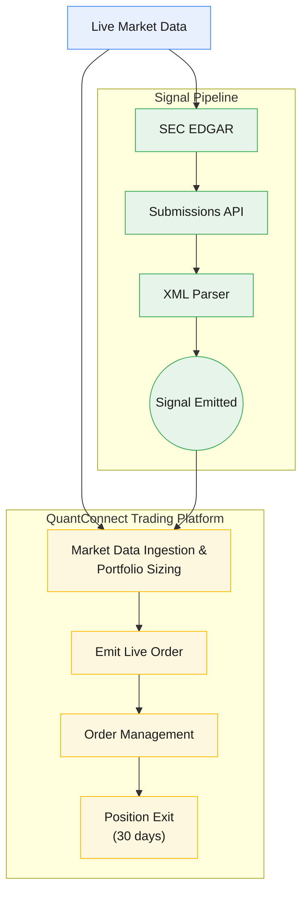
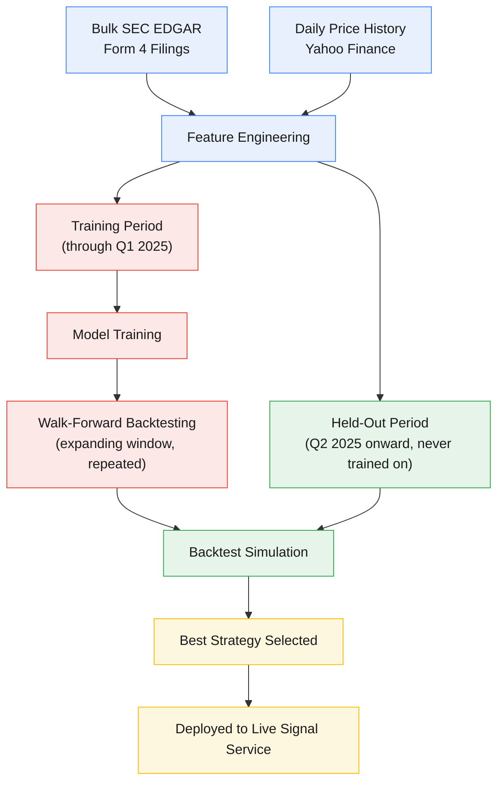

# Form 4 Insider-Signal Pipeline

An automated SEC Form 4 parser which filters and emits transactions matching specific criteria.

This repo showcases the **general architecture, data pipeline, and research
methodology** behind that service, plus **real performance data** for the
live service since launch. It's intentionally general — the specific filter
thresholds, scoring weights, and model parameters that make the strategy work
are not included.

### Live signal pipeline & trading system



See [architecture.md](docs/architecture.md) for what each stage actually does.

### Research & training pipeline



A single chronological cutoff (Q1/Q2 2025) separates training from
validation, applied consistently across model training, hyperparameter
search, and backtesting — data on or after the cutoff is never used for
training, only to check performance on data the model hasn't seen. See
[methodology.md](docs/methodology.md) for the full explanation, including
what "walk-forward" means here and a research-integrity note about a
look-ahead bug that was caught and fixed.

## Headline result

Since launch (2026-02-17), **116 real executed trades** (reconstructed from
actual brokerage fills — real entry/exit dates, real position sizes) have
beaten IWM, bought at those exact same times and sizes, **57.8% of the time**,
with a dollar-weighted mean return of **+3.7%** vs. **+1.5%** for the matched
IWM trades — a **+2.3 percentage point** edge. Those 116 trades came from 636
raw signals emitted by the live service; most signals never become a real
trade once real execution constraints (cash, exposure limits, dedup) are
applied. See [`docs/performance.md`](docs/performance.md) for the full
writeup, the raw-signal-only comparison, methodology, and limitations.

## Read more

- [**Architecture**](docs/architecture.md) — how filings are ingested, parsed,
  and filtered into a live signal, the deployment shape of the service, and
  how the signal reaches the downstream trading system.
- [**Methodology**](docs/methodology.md) — the research/training pipeline
  behind the live rule: data, feature engineering, model, backtesting, and a
  research-integrity note about a bug that was caught and fixed.
- [**Performance**](docs/performance.md) — the full live performance
  write-up vs. the Russell 2000, with a chart and stated limitations.

## What this repo does NOT include

- The exact filter thresholds, scoring weights, or model hyperparameters —
  these are the tuned, proprietary part of the strategy.
- Raw signal logs, brokerage account data, or transaction-level records
  (tickers, dates, position sizes, dollar amounts) — only aggregated,
  percentage-only results are published (see
  [`analysis/summary_stats.csv`](analysis/summary_stats.csv) and
  [`analysis/real_trades_summary.csv`](analysis/real_trades_summary.csv)).
- The trading system's exact internal logic (sizing formulas, order-execution
  edge cases, exact thresholds) or its unrelated second strategy — only the
  high-level stages it goes through are described, in
  [architecture.md](docs/architecture.md).
- Any live service endpoints/URLs — the transport mechanism is described,
  but the actual addresses are withheld since those endpoints currently have
  no authentication layer.

## Repo contents

```
docs/                              architecture, methodology, and performance write-ups
assets/real_trades_chart.png       real executed trades vs. matched-size/date IWM (primary)
assets/performance_chart.png       raw signal feed vs. matched-date IWM (secondary/context)
analysis/compute_performance.py    re-runnable script for the raw-signal comparison
analysis/summary_stats.csv         its aggregated output
analysis/real_trades_summary.csv   aggregated real-trade output (not re-runnable here -
                                    depends on private brokerage account access)
```

`compute_performance.py` doesn't hardcode the live service's real endpoint
(see the note above on withheld URLs). Point it at a signal-log CSV yourself
to reproduce the analysis:

```bash
python3 analysis/compute_performance.py --signal-log-url <your-signal-log-url>
# or, against a local file:
python3 analysis/compute_performance.py --signal-log-file path/to/signal_log.csv
```

## License

MIT — see [LICENSE](LICENSE).
