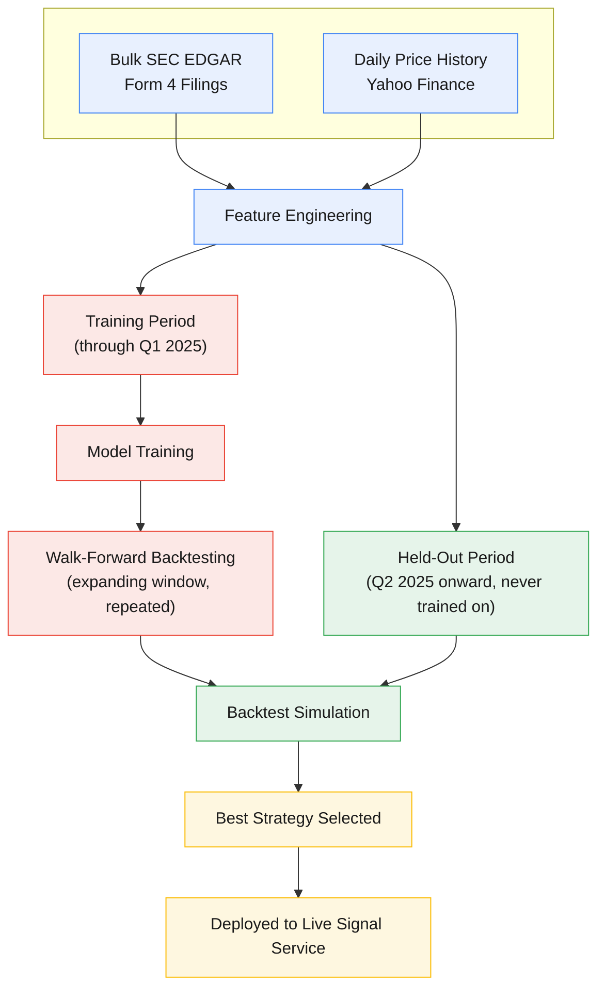

# Research & Training Methodology

The live service (see [architecture.md](architecture.md)) is a simple,
rules-based filter. Underneath it is a broader research pipeline that mines
years of historical insider-trading data to figure out which signals are
actually worth following, and to stress-test the live rule before it's
trusted with real decisions.

## Process overview

The split is a single chronological cutoff at Q1/Q2 2025, applied
consistently across model training, hyperparameter search, and backtesting:
everything before the cutoff trains, everything from the cutoff forward is
**held out and never trained on** — used only to check performance on data
the model genuinely hasn't seen. It's a quarter boundary, not a full excluded
calendar year. The **walk-forward backtesting** loop is the "expanding
window" mentioned above: train on an initial period, validate on the period
right after it, then expand the training window to include that period and
validate on the next one, and so on — a repeated, rolling process rather than
a single train/test split. This
catches a strategy that only works in one specific historical regime, which a
single split could miss.

## Data

The research pipeline is built on multi-year SEC EDGAR bulk Form 4 data —
every open-market insider purchase and sale filed with the SEC, spanning many
years — cross-referenced with daily price history for the underlying stocks.
This is a much larger dataset than what the live service touches on any given
day: it exists to answer "does this kind of signal work, historically?"
rather than to drive any single day's decision.

## Feature engineering

Every historical purchase is enriched with a set of contextual features
before it's used for research, grouped conceptually as:

- **Insider track record** — how active this specific person has been as a
  buyer, and how long they've been filing.
- **Insider conviction** — how large this purchase is relative to the
  insider's resulting overall position (a proxy for how much personal
  conviction it represents, versus a token gesture).
- **Ticker-level activity** — how much insider buying vs. selling has
  happened recently in this stock, and how many distinct insiders are
  involved.
- **Temporal/momentum context** — how recent and how clustered the insider
  buying at a given ticker has been.
- **Filing speed** — how quickly the purchase was disclosed after it
  happened.
- **Market context** — market-cap band, recent price drawdown relative to the
  broader market, and 52-week price positioning.
- **Insider seniority** — role-based weighting (a CEO's purchase and a
  director's purchase aren't treated identically).

Note: the drawdown/market-context features above are computed relative to the
S&P 500 as a broad reference — a different benchmark from the Russell
2000/IWM comparison the live service itself uses for its win-rate gate. These
serve different purposes and shouldn't be conflated.

The exact numeric definitions and weights behind these categories (what
counts as "experienced," which market-cap band is targeted, how the pieces
are combined) are intentionally not published — they're the tuned part of the
strategy.

## Model

The forward-return model is a **gradient-boosted regression model
(LightGBM)**, trained to predict a stock's forward return over a range of
holding-period horizons rather than a single fixed window. The
best-performing horizon is chosen based on out-of-sample validation
performance, not assumed in advance.

Validation uses a strictly **time-based train/validation split** — everything
before a cutoff date trains the model, everything after validates it — rather
than a random or k-fold split, specifically to avoid letting the model learn
from the future. An expanding-window walk-forward check is layered on top,
along with an explicit overfitting guard that flags any case where validation
performance falls well short of training performance (see
[challenges.md](challenges.md) for why that guard only warns, never
auto-rejects).

## Backtesting

Candidate filtering rules are evaluated with a grid search across multiple
filter definitions, multiple holding-period horizons, and multiple
position-sizing approaches (including a fractional-Kelly-criterion sizing
model), simulated day-by-day with realistic overlapping positions and a fixed
starting capital. Standard portfolio metrics — Sharpe ratio, CAGR, win rate,
max drawdown, and signal frequency — are used to compare candidates.

## A research-integrity note

An earlier version of the backtest dataset had a subtle bug: when building an
insider's "prior track record" for a given signal, the dataset boundary
accidentally let the signal's *own* purchase count as part of its own history.
Since a signal always looks perfect in hindsight to itself, this quietly
inflated every downstream win-rate calculation that depended on it — some
backtests looked dramatically better than they actually were.

Once identified, this was fixed by strictly requiring that only purchases
transacted *and filed* before a signal's own date could count toward that
signal's historical track record. Realistic, leak-free expectations for this
kind of insider-purchase filtering are modest: a majority-but-not-overwhelming
win rate and a single-digit percentage average return per trade — not the
dramatically higher figures the leaked version had produced. That's a more
honest number to build on, even though it's a less exciting headline.

This turned out to be one instance of a recurring mistake, not a one-off —
see [challenges.md](challenges.md) for the fuller pattern across other
features, plus the position-sizing research that happened alongside it.

For real, computed live results (not backtest projections), see
[performance.md](performance.md).
