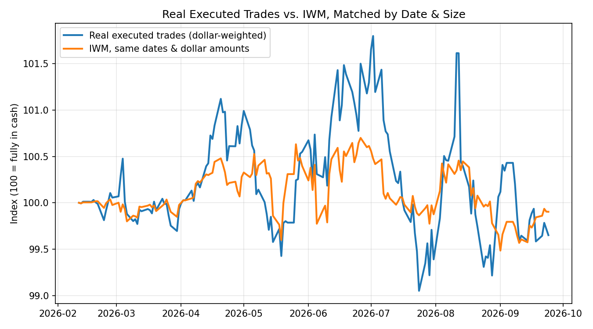
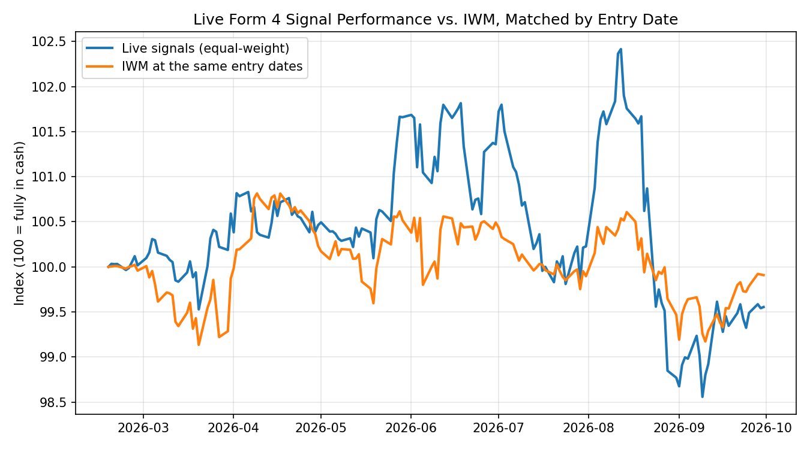

# Live Performance vs. the Russell 2000

This page has two comparisons. The first — **real executed trades** — is the
one that matters: what actually happened, sized and timed exactly as it
really was, compared to buying IWM at those same times and sizes. The second
— **raw signal quality** — measures the pre-filter signal feed itself, before
any of the real trading system's execution constraints are applied. They're
kept separate on purpose: the raw feed emits far more signals than ever
become real trades, and blending the two would overstate what the live
system actually does. See [methodology.md](methodology.md) for how both of
these differ from the offline research/backtest numbers.

## Real executed trades

Reconstructed from the trading system's own real fills — real entry dates,
real exit dates, real position sizes — filtered to trades the system placed
specifically because of a Form 4 signal (its unrelated second strategy,
mentioned in [architecture.md](architecture.md), is excluded). Round trips
are completed buy-then-sell pairs; a handful of positions still open as of
this writing aren't included, since they don't have a real exit yet.

| Metric | Value |
|---|---|
| Round trips completed | **116** (out of 636 raw signals emitted — most signals never become a trade; see below) |
| Unique tickers traded | 92 |
| Win rate vs. IWM (same dates) | **57.8%** |
| Dollar-weighted mean return | **+3.7%** |
| Dollar-weighted mean IWM return (same dates, same dollar amounts) | +1.5% |
| Dollar-weighted mean alpha | **+2.3pp** |

"Dollar-weighted" means a $5,000 trade counts five times as much toward the
average as a $1,000 trade — matching how the results actually add up in a
real account, rather than treating every trade as equal-size. The IWM side of
the comparison uses the *same* dollar amount and the *same* entry/exit dates
as the real trade it's matched against, so the only variable that differs is
which asset was bought.

Both lines are a genuine day-by-day equity curve, not an average of returns:
a hypothetical account sized to hold every trade at once (in practice, most
of that capital sits idle as cash most days, since positions don't all
overlap) marks each open position to market daily using its real price path,
whether that position is in the real traded stock or, on the second line,
IWM instead — same entry date, same exit date, same dollar amount either
way. Both necessarily start at exactly 100 (before the first trade, the
whole account is cash), and move smoothly from there.

Only percentage returns are published here. No dollar amounts, account
balances, or individual trade records (tickers, dates, position sizes) are
shown — this reconstruction was built from real brokerage data that isn't
part of this repo and can't be independently re-run without access to that
account.

### Why only 116 of 636 signals became real trades

This is the number that actually matters, and it's a small fraction of the
raw feed. The live trading system applies real constraints the raw signal
feed doesn't: available cash, an aggregate-exposure cap, per-ticker dedup (no
buying something already held), and rejection/ban handling when a broker
declines an order. Most emitted signals don't survive all of that — which is
exactly why the "raw signal quality" numbers below shouldn't be read as "what
the account did."

### Why "+3.7% average per trade" looks smaller than the account's actual gain

The account runs two strategies (see [architecture.md](architecture.md)):
this one, and an unrelated second strategy trading a completely different
universe of tickers. Comparing realized profit between the two, **this
strategy accounts for roughly 86% of the account's total realized trading
profit** over the same period — it's the dominant driver, not a minor
contributor.

That's not in tension with a modest "+3.7% average per trade" — they're
different units. The account's capital gets *reused*: the same dollars close
one 30-day position and open another, over and over, 116 times across 92
tickers over ~7 months. A modest edge repeated that many times compounds into
a real cumulative effect on the account far larger than any single trade's
average return would suggest. "Average return per trade" and "total realized
contribution to the account" are both honest numbers — they just answer
different questions, and only the second one is comparable to "the account is
up X% and most of that is this strategy."

## Raw signal quality (for context)

**What this measures, precisely:** the raw signal feed itself, before
execution. It's "take every emitted signal, weight them equally, hold each
for exactly 30 days, don't compound" — a diagnostic of signal quality, not a
reconstruction of any real trading activity.

| Metric | Value |
|---|---|
| Live signal history | 2026-02-17 – present |
| Total signals emitted | 636 |
| Signals scored (30-day window elapsed) | 569 |
| Win rate vs. IWM (30d) | 57.6% |
| Mean 30-day return per signal | +3.5% |
| Mean IWM 30-day return over the same windows | +0.9% |
| Mean alpha vs. IWM per signal | +2.6pp |

(These figures shift slightly each time the analysis is re-run, since more
signals cross the 30-day scoring threshold every day — see
[`analysis/summary_stats.csv`](../analysis/summary_stats.csv).)

Same day-by-day mark-to-market method as the real-trades chart above, but
equal-weighted rather than dollar-weighted (there's no real position size to
weight by for a signal that was never traded), and every signal held for a
fixed 30 days rather than a real, variable exit date. The chart stops about a
month before today, since recent signals don't have a resolved 30-day window
yet.

This is close to the real-trades numbers above, which is a reasonable
consistency check, but it isn't the same measurement — see the previous
section for why the executed-trade count is so much smaller than the signal
count.

## Limitations

- **Short history.** ~7 months, 116 real round trips, is enough to see a
  real, positive edge but not enough to rule out a lucky stretch.
- **Signal-definition changes.** The live service's exact signal-emission
  logic changed more than once during this window (see
  [architecture.md](architecture.md)); early signals don't reflect the
  current rule exactly.
- **Entry price basis.** Realized-return figures (the table, and the
  real-trades section's per-trade stats) use the real fill price where one
  exists. The day-by-day *charts* for both sections instead anchor to the
  price-data provider's own close on the entry date, even for real trades —
  a handful of tickers have had a real corporate action (e.g. a reverse
  split) between the trade date and today that the data provider's history
  retroactively restates, which would otherwise silently mismatch a real
  fill price against today's adjusted series and distort the chart. This
  doesn't change the realized-return table, only how the chart is drawn.
- **Survivorship.** Price data (both sections) is sourced from a public
  market-data provider, which can silently exclude delisted tickers from
  history — a real but typically small upward bias.
- **Still-open positions excluded.** A handful of real positions were still
  held as of this writing and aren't in the round-trip count, since they
  don't have a real exit yet.

The raw-signal analysis script is in
[`analysis/compute_performance.py`](../analysis/compute_performance.py) and
is re-runnable by anyone against the live public signal feed. The
real-trades reconstruction depends on private brokerage account access and
isn't published as a script for that reason — the numbers above are the full
output of that analysis.
